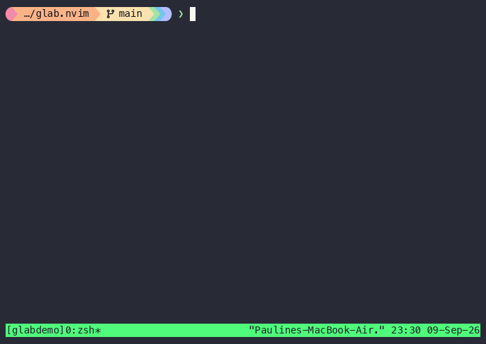

# glab.nvim

[](https://github.com/ibisch-dev/glab.nvim/actions/workflows/stylua.yml)
[](https://github.com/ibisch-dev/glab.nvim/actions/workflows/luacheck.yml)

Manage GitLab merge requests from Neovim by shelling out to the
[`glab`](https://gitlab.com/gitlab-org/cli) CLI, with diffs rendered by
[codediff.nvim](https://github.com/esmuellert/codediff.nvim).



This plugin does not implement its own diff fetching or rendering — it
delegates entirely to codediff.nvim's `:CodeDiff pr {number}`, which already
fetches GitHub/GitLab/Azure DevOps PRs/MRs using your git remote's existing
auth. glab.nvim adds the GitLab-specific layer on top: browsing merge
requests, viewing metadata, approving/merging/checking out, and full inline
discussion threads (reply, resolve, new comments) overlaid on the diff.

## Requirements

- Neovim >= 0.10 (uses `vim.system`)
- [`glab`](https://gitlab.com/gitlab-org/cli), authenticated (`glab auth login`)
- [codediff.nvim](https://github.com/esmuellert/codediff.nvim)

Run `:checkhealth glab` after installing to verify all three.

## Installation (lazy.nvim)

```lua
{
  "ibisch-dev/glab.nvim",
  dependencies = { "esmuellert/codediff.nvim" },
  cmd = "Glab",
  opts = {},
}
```

## Usage

All functionality is exposed through a single `:Glab` command, mirroring
`glab`'s own subcommand grammar:

| Command | Effect |
|---|---|
| `:Glab mr list [flags]` | Pick a merge request (passes flags through to `glab mr list`, e.g. `-a me`, `--label bug`) |
| `:Glab mr view [iid]` | Open a buffer with the MR's description, comments, and activity |
| `:Glab mr diff [iid]` | Open the MR's diff via codediff.nvim, with discussion threads overlaid |
| `:Glab mr approve [iid]` | Approve the MR |
| `:Glab mr merge [iid]` | Merge the MR (asks for confirmation first) |
| `:Glab mr checkout [iid]` | Check out the MR's branch locally |
| `:Glab mr close [iid]` / `:Glab mr reopen [iid]` | Close / reopen the MR |
| `:Glab mr note list [iid]` | Browse discussion threads (works even without an open diff) |
| `:Glab mr note update <iid> <note-id> -m <text>` | Edit a note's body |
| `:Glab mr note delete <iid> <note-id>` | Permanently delete a note |

`iid` is optional everywhere — omitting it resolves to the current branch's
merge request, same as bare `glab mr view`/`glab mr diff` on the CLI.

### The MR view buffer

Opened by `:Glab mr list` or `:Glab mr view`. Default keymaps (all
configurable, see below):

| Key | Action |
|---|---|
| `gd` | Open the diff |
| `ga` | Approve |
| `gM` | Merge |
| `gco` | Checkout |
| `gx` | Open in browser |
| `gr` | Refresh |
| `q` | Close |

### Discussion threads on the diff

Once `:Glab mr diff` is open, lines with existing discussions are marked in
the sign column. Default keymaps on marked buffers:

| Key | Action |
|---|---|
| `gt` | Show the thread on the current line |
| `gn` | Start a new thread on the current line |
| `]t` / `[t` | Jump to next / previous thread in the buffer |

Inside a thread's floating window:

| Key | Action |
|---|---|
| `r` | Reply |
| `R` | Resolve / reopen |
| `e` | Edit a note (prompts if the thread has more than one) |
| `d` | Delete a note, after confirming (permanent — cannot be undone) |
| `q` | Close |

> The mapping from GitLab's file+line positions onto codediff.nvim's diff
> panes relies on codediff's buffer-naming conventions, which are not part of
> its documented public API — this has been tested end-to-end against real
> merge requests, but a future codediff.nvim update could still change those
> conventions. If marks ever stop appearing on a given setup, discussion
> threads are still fully readable and writable via `:Glab mr note list`,
> which has no dependency on the diff view at all.

## Configuration

```lua
require("glab").setup({
  glab_cmd = "glab",
  diff = {
    codediff_extra_args = {}, -- e.g. { "--remote", "upstream" }
  },
  discussions = {
    sign_text = "▌",
    sign_hl = "DiagnosticSignInfo",
    resolved_sign_hl = "DiagnosticSignOk",
    virtual_text = true,
  },
  keymaps = {
    view = {
      diff = "gd", approve = "ga", merge = "gM", checkout = "gco",
      open_browser = "gx", refresh = "gr", close = "q",
    },
    discussion = {
      toggle_thread = "gt", new_thread = "gn", reply = "r", resolve = "R",
      next_thread = "]t", prev_thread = "[t",
    },
  },
})
```

## License

MIT
